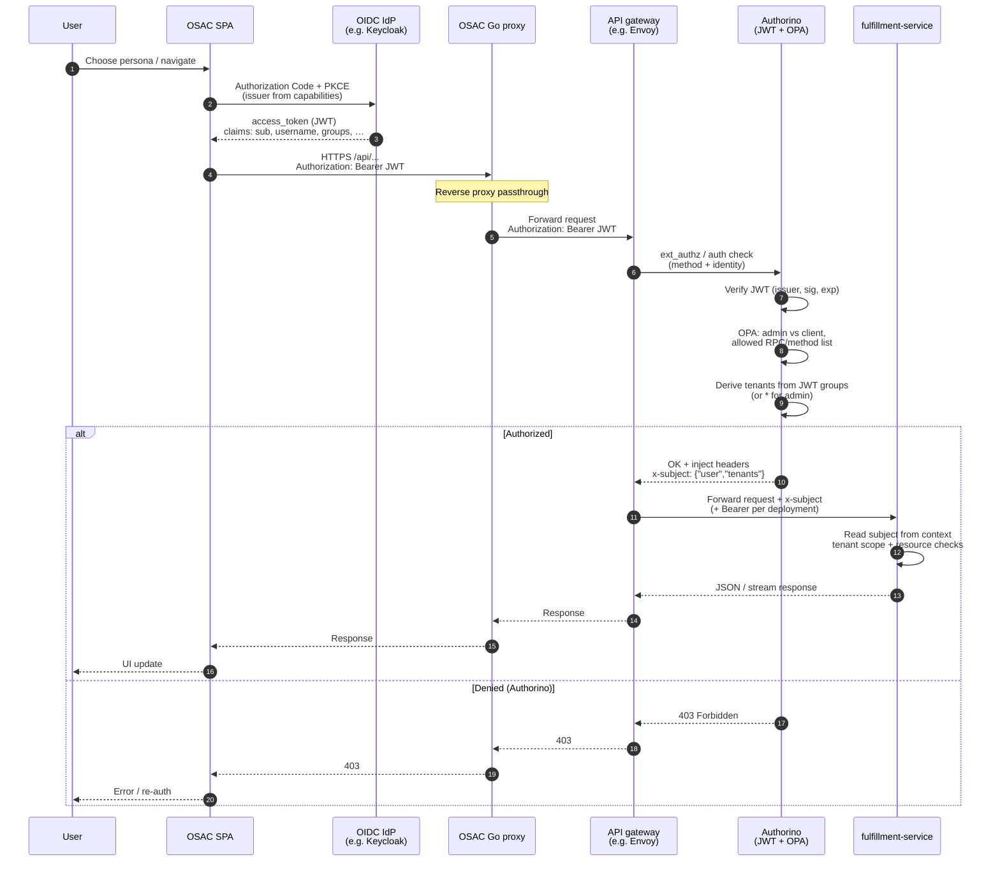
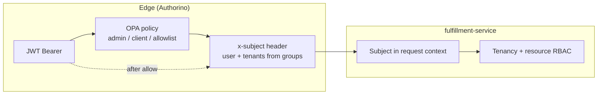

# OSAC — VM-as-a-Service Frontend

OSAC is a fullstack demo application for an OpenShift-based VM-as-a-Service platform. It provides a multi-tenant UI built with React + PatternFly 6, backed by a Go chi reverse proxy that forwards requests to the upstream fulfillment API.

---

## Table of contents

- [Repository layout](#repository-layout)
- [Prerequisites](#prerequisites)
- [Quick start (development)](#quick-start-development)
- [Running modes explained](#running-modes-explained)
- [Authorization (dev mode and fulfillment RBAC)](#authorization-dev-mode-and-fulfillment-rbac)
- [Demo personas and entry points](#demo-personas-and-entry-points)
- [What is implemented](#what-is-implemented)
- [What needs real integration or further testing](#what-needs-real-integration-or-further-testing)
- [Build and container](#build-and-container)
- [OpenShift deployment](#openshift-deployment)
- [Workspace scripts reference](#workspace-scripts-reference)
- [Project structure](#project-structure)

---

## Repository layout

```
osac/
├── apps/
│   ├── app-frontend/       # React SPA (PatternFly 6, React Router, TanStack Query)
│   └── e2e/                # Cypress end-to-end tests
├── libs/
│   ├── api-contracts/      # Shared TypeScript types + wire normalizers
│   ├── config/             # Shared ESLint, Prettier, tsconfig base
│   └── ui-components/      # Shared PatternFly components (LightDarkToggle, VmStatusLabel, …)
├── proxy/                  # Go chi reverse proxy — forwards /api/* to FULFILLMENT_API_URL
├── deploy/
│   ├── dev/                # OpenShift manifests — development namespace
│   └── integration/        # OpenShift manifests — integration namespace
├── Containerfile           # Multi-stage build (SPA + Go proxy → single image)
└── package.json            # Root pnpm workspace scripts
```

---

## Prerequisites

| Tool    | Minimum version |
| ------- | --------------- |
| Node.js | 20              |
| pnpm    | 9               |
| Go      | 1.23            |

Install pnpm if you don't have it:

```bash
npm install -g pnpm
```

Install all workspace dependencies from the repo root:

```bash
pnpm install
```

---

## Quick start (development)

You need a running fulfillment API. Point `FULFILLMENT_API_URL` at it

```bash
FULFILLMENT_API_URL=https://fulfillment.your-env.example.com pnpm dev
# Server starts on http://localhost:5173
```

Open [http://localhost:5173](http://localhost:5173). Unauthenticated visitors are redirected through OIDC sign-in via the Go proxy.

---

## Proxy

The Go chi proxy (`proxy/`) is a pure reverse proxy. It has no mock mode — it always forwards to `FULFILLMENT_API_URL`.

Proxied path prefixes:

| Prefix                  | Destination                            |
| ----------------------- | -------------------------------------- |
| `/api/fulfillment/v1/*` | `$FULFILLMENT_API_URL` + original path |
| `/api/events/v1/*`      | `$FULFILLMENT_API_URL` + original path |
| `/api/osac/public/v1/*` | `$FULFILLMENT_API_URL` + original path |

`/health` and `/ready` are handled locally and return JSON `{ "status": "ok" }` / `{ "status": "ready" }`.

### Environment variables reference

| Variable                         | Default      | Description                                                                        |
| -------------------------------- | ------------ | ---------------------------------------------------------------------------------- |
| `FULFILLMENT_API_URL`            | _(required)_ | Base URL of the upstream fulfillment API (e.g. `https://fulfillment.example.com`). |
| `PORT`                           | `8080`       | Proxy listen port.                                                                 |
| `HOST`                           | `0.0.0.0`    | Proxy listen host.                                                                 |
| `LOG_LEVEL`                      | `info`       | Log level: `debug`, `info`, `warn`, `error`.                                       |
| `FULFILLMENT_TLS_CA_FILE`        | _(unset)_    | PEM bundle for proxy → fulfillment TLS (private PKI).                              |
| `FULFILLMENT_TLS_INSECURE`       | _(unset)_    | Set to `1` to skip TLS verification for upstream (dev only).                       |
| `TEMP_FULFILLMENT_STATIC_BEARER` | _(unset)_    | TEMP: inject `Authorization: Bearer …` when the client sends no non-empty Bearer.  |
| `OIDC_CLIENT_ID`                 | `osac-ui`    | client_id registered in the IdP for this UI application.                           |
| `OIDC_TLS_INSECURE`              | _(unset)_    | Set to `1` to skip TLS verification for auth provider (dev only).                  |

**SPA (Vite dev):** optional `VITE_DEV_BEARER_TOKEN` — see `apps/app-frontend/.env.example`. Public API contract: [buf.build/osac-project/public-api](https://buf.build/osac-project/public-api) (this repo uses REST via the proxy until Connect/gRPC-Web is confirmed on the live gateway).

---

## Authorization (fulfillment RBAC)

With `FULFILLMENT_API_URL` set, the SPA calls the **Go chi proxy** on same-origin `/api`; the proxy forwards fulfillment requests upstream. Between the browser and fulfillment-service, the cluster typically runs an **API gateway + Authorino**: Authorino validates the JWT, runs policy (for example OPA: admin vs client and allowed operations), maps **JWT `groups`** (or equivalent claims) to **tenant scope**, and injects **x-subject** (`user` + `tenants`) for fulfillment-service. The service then enforces tenancy and resource-level access. The browser never receives `x-subject`; it is an edge-to-service contract.

**Current SPA behavior:** unauthenticated users hit `SignInPage`, which redirects through **OIDC Authorization Code + PKCE** via the Go proxy (`proxy/auth/`). After callback, the SPA attaches `Authorization: Bearer` on proxied API calls. See `docs/specs/backend-fulfillment.yaml` → `context.osac_proxy_integration`.

### End-to-end sequence (SPA → Authorino → fulfillment-service)



### Where `x-subject` fits (edge vs application)



---

## Demo personas and entry points

The SPA uses **OIDC** for authentication. For local development and Cypress, role/tenant context is stored in `sessionStorage` under `osac.persona` (set by E2E helpers or deep links).

| Role            | Default landing route   | Surfaces                                                                 |
| --------------- | ----------------------- | ------------------------------------------------------------------------ |
| `providerAdmin` | `/provider/dashboard`   | Organizations, global templates, infrastructure topology                 |
| `tenantAdmin`   | `/admin/dashboard`      | Users, template catalog, networks topology                               |
| `tenantUser`    | `/dashboard`            | VM dashboard, My VMs, template catalog                                   |

Deep-link a persona on cold load (sets tenant + role before OIDC completes):

```
http://localhost:5173/?osac-entry=northstar-user
http://localhost:5173/?osac-entry=northstar-admin
http://localhost:5173/?osac-entry=evergreen-user
http://localhost:5173/?osac-entry=evergreen-admin
```

(`evergreen-*` is the tenant id for Bluestone Financial in code; the UI may label it “Bluestone”.)

---

## What is implemented

````mermaid
flowchart TB
  subgraph Users["Clients"]
    UI[osac-ui / consoles]
    CLI[fulfillment-cli archived]
  end

  subgraph Core["Core runtime"]
    FS[fulfillment-service API + DB]
    OP[osac-operator CRDs + reconcile]
  end

  subgraph Deploy["Integration & install"]
    INS[osac-installer]
  end

  subgraph Auto["Automation"]
    AAP[osac-aap]
  end

  subgraph Platform["Hub / cloud stack"]
    ACM[ACM / MCE / HCP]
    VIRT[OCP-Virt / KubeVirt]
    OVN[OVN UDN / Tenant networking]
    KC[Keycloak / OIDC]
    AUTH[Authorino / gateway policy]
  end

  subgraph More["Other org repos public listing"]
    DOC[docs]
    EP[enhancement-proposals]
    TI[osac-test-infra]
    GC[github-config]
    WS[osac-workspace]
    HM[host-management-openstack]
    ISS[issues]
  end

  UI --> FS
  CLI -.->|archived| FS
  FS --> OP
  FS --> KC
  INS --> FS
  INS --> OP
  INS --> AAP
  OP --> AAP
  OP --> ACM
  OP --> VIRT
  OP --> OVN
  OP --> AUTH
  DOC -.-> DOC
  TI -.->|e2e| INS
````

### Frontend (React SPA)


| Area                               | Status | Notes                                                                                                               |
| ---------------------------------- | ------ | ------------------------------------------------------------------------------------------------------------------- |
| OIDC sign-in (`/`, `/callback`)   | ✅      | Auto-redirect via Go proxy; session cookie + refresh                                                                |
| Application shell                  | ✅      | Masthead, role-based sidebar nav, light/dark toggle                                                                 |
| Tenant user dashboard              | ✅      | VM power-state stat cards from `compute_instances`, create VM                                                       |
| My VMs — card / table views        | ✅      | Power filter, search, detail drawer, power actions, delete                                                          |
| Create VM wizard                   | ✅      | Client-side validation; POST `compute_instances` via fulfillment API                                                  |
| Template catalog                   | ✅      | `compute_instance_templates` API; launches wizard                                                                   |
| Tenant admin dashboard             | ✅      | VM + user metrics, navigation tiles                                                                                 |
| Tenant admin — Users               | ✅      | `GET /api/fulfillment/v1/users`                                                                                     |
| Tenant admin — Networks            | ✅      | Topology from VM list (`spec.subnet` grouping)                                                                      |
| Provider admin dashboard           | ✅      | Org + VM metrics, navigation tiles                                                                                  |
| Provider — Tenant organizations    | ✅      | `GET /api/fulfillment/v1/organizations`                                                                           |
| Provider — Infrastructure topology | ✅      | Platform-wide VM topology                                                                                           |
| Provider — Global templates        | ✅      | Reuses template catalog                                                                                             |
| Light / dark theme                 | ✅      | Togglable in sidebar footer                                                                                         |
| RBAC — nav and route guards        | ✅      | Nav items and routes are role-gated (client-side persona for dev/E2E)                                                |


### Backend (Go chi proxy)


| Area                           | Status | Notes                                                                                                                                 |
| ------------------------------ | ------ | ------------------------------------------------------------------------------------------------------------------------------------- |
| Upstream proxy                 | ✅      | `/api/fulfillment/v1/*` — passthrough to `FULFILLMENT_API_URL`                                                      |
| OIDC login / logout / refresh  | ✅      | `/api/login`, `/api/logout`, `/api/login/refresh`, `/api/login/info`                                                 |
| Health / readiness probes      | ✅      | `/health` and `/ready`                                                                                                |
| TLS upstream                   | ✅      | Custom CA via `FULFILLMENT_TLS_CA_FILE`; dev-only insecure skip via `FULFILLMENT_TLS_INSECURE`                       |
| Authorization passthrough      | ✅      | Session cookie from OIDC; inbound `Authorization` forwarded when present                                            |


### Shared libraries


| Library                                                          | Status |
| ---------------------------------------------------------------- | ------ |
| `@osac/api-contracts` — TypeScript types + wire normalizers    | ✅      |
| `@osac/ui-components` — `LightDarkToggle`                        | ✅      |
| `@osac/ui-components` — `VmStatusLabel`                        | ✅      |
| `@osac/ui-components` — `NetworkTopologyPage`                    | ✅      |


---

## What needs real integration or further testing

Authoritative integration checklist: `docs/specs/backend-fulfillment.yaml`. The SPA calls fulfillment APIs directly; features without upstream support are omitted from the UI rather than mocked.

### Authentication

- **Implemented:** Authorization Code + PKCE via Go proxy (`/api/login`, `/callback`); session refresh; logout.
- **Dev/E2E persona:** Role and tenant for nav gating come from `sessionStorage` (`osac.persona`) or `?osac-entry=` — not yet derived from JWT claims/RBAC API.

### Per-tenant data scoping

- The frontend does not send an explicit tenant header today; upstream RBAC must scope `compute_instances`, users, and organizations to the signed-in subject.

### VM power actions, deletion, and creation

- Start / Stop / Restart, delete-with-confirm, and create-from-template wizard POST to `/api/fulfillment/v1/compute_instances` with client-side pending UI until list GET reflects the new state.

### Not yet in UI (no fulfillment API wired)

- Quota, utilization metrics, recent activities / events feed, VM console, user invite/remove, placeholder admin settings pages.

### E2E tests

- Cypress specs: `sign-in-entry`, `application-shell-session`. Extend coverage for VM CRUD and wizard flows as APIs stabilize.

---

## Build and container

### Production build (SPA + BFF compiled)

```bash
pnpm build
````

This runs `tsc` on the backend and `vite build` on the frontend. The SPA output lands in `apps/app-backend/public/` so the BFF can serve it.

### Container image

```bash
# Build
podman build -t osac:latest -f Containerfile .

# Run in mock mode
podman run --rm -p 8080:8080 -e OSAC_API_MODE=mock osac:latest

# Run in dev/proxy mode
podman run --rm -p 8080:8080 \
  -e OSAC_API_MODE=dev \
  -e FULFILLMENT_API_URL=https://fulfillment.your-env.example.com \
  osac:latest
```

The container exposes port `8080`. The BFF serves the SPA at `/` and the API at `/api/*`.

---

## OpenShift deployment

Manifests live in `deploy/dev/` and `deploy/integration/`. See [`docs/deployment-openshift-guide.md`](docs/deployment-openshift-guide.md) for a full step-by-step guide covering Keycloak setup, OIDC client registration, and troubleshooting.

**Prerequisites** (full setup in the guide):

- OpenShift cluster with `oc` CLI access.
- **fulfillment-service** deployed and reachable (`fulfillment-internal-api` Service must exist).
- **Keycloak** deployed with an OIDC realm (e.g. `osac`).
- Container image pushed to a registry (if not using the default image).

```bash
# Create namespace
oc new-project osac-dev

# Edit configmap.yaml — set FULFILLMENT_API_URL to the internal fulfillment Service URL
# Apply all manifests
oc apply -f deploy/dev/

# Watch rollout
oc rollout status deployment/osac -n osac-dev

# Get route URL
oc get route osac -n osac-dev -o jsonpath='{.spec.host}'
```

The `configmap.yaml` in each environment folder controls `FULFILLMENT_API_URL`, `OIDC_CLIENT_ID`, TLS settings, and `LOG_LEVEL`. Edit it before applying.

---

## Workspace scripts reference

Run all scripts from the **repo root**:

| Script                     | Description                                                              |
| -------------------------- | ------------------------------------------------------------------------ |
| `pnpm dev:proxy`           | Start Go chi proxy (`proxy/`) on `:8080`; requires `FULFILLMENT_API_URL` |
| `pnpm dev:frontend`        | Start Vite dev server with HMR on `:5173`; proxies `/api/*` to `:8080`   |
| `pnpm build`               | Build SPA (`apps/app-frontend/dist`) and compile Go proxy binary         |
| `pnpm lint`                | ESLint across all packages                                               |
| `pnpm check:pf-primitives` | Guardrail: disallowed raw HTML for layout in `app-frontend`              |
| `pnpm test`                | Vitest unit tests across all packages                                    |
| `pnpm storybook`           | Start Storybook for `@osac/ui-components`                                |
| `pnpm build-storybook`     | Build static Storybook                                                   |
| `pnpm e2e:ci`              | Run Cypress E2E tests headlessly                                         |

---

## Project structure

```text
libs/api-contracts/src/
  types.ts                    # Shared domain interfaces
  *Normalize.ts               # Wire → TS normalizers (compute, org, user, templates)
  shellLabels.ts              # Masthead role labels
  vmPowerState.ts             # Power state helpers

apps/app-frontend/src/
  App.tsx                     # Routes: /, /callback, /* → AppShell when logged in
  api/
    client.ts                 # Typed fetch → /api/fulfillment/v1/*
    hooks.ts                  # TanStack Query hooks
  contexts/
    SessionContext.tsx        # OIDC session, persona (dev/E2E), theme, topology handoff
  pages/
    auth/                     # SignInPage, AuthCallback
    shell/                    # AppShell, ShellMasthead, ShellSidebar, shellNav, shellRoutes
    tenant/                   # DashboardPage, VmListPage, CatalogPage
    admin/                    # AdminDashboardPage, AdminUsersPage, AdminNetworksPage
    provider/                 # Provider dashboards, orgs, infrastructure topology
  components/
    vm/
      CreateVmWizard.tsx      # Modal orchestrator
      createVmWizard/         # Steps, validation (wizardBuild.ts), constants
      VmDetailDrawer.tsx, VmActionsMenu.tsx, …

proxy/
  main.go                     # Go chi reverse proxy + OIDC auth
```

**Routing recap:** `App.tsx` imports shell and auth pages from `pages/shell` and `pages/auth`. Logged-in routes live under `AppShell` (`pages/shell/AppShell.tsx`) and map to `tenant/`_, `admin/`_, and `provider/*` paths per role (see `docs/specs/ui-flows/application-shell-session.yaml` for the canonical matrix).
